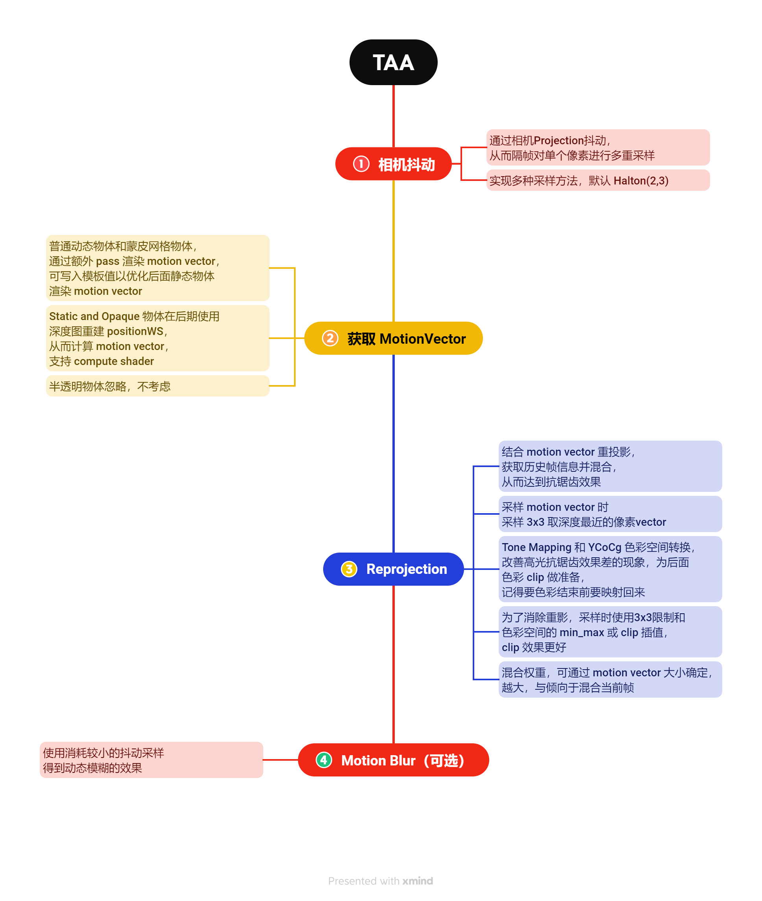

# Unity_URP_TAA_Project

### 效果对比

https://github.com/ChillyHub/Unity_URP_TAA_Project/assets/75598757/77fa81ff-7d3a-47c8-8d6d-36810bb3f5d6

###### 1.

###### 2.

### 流程

### 参考引用

[1] GDC:  Temporal Reprojection Anti-Aliasing in INSIDE

[2] Anti-Aliasing Methods in CryENGINE 3: http://iryoku.com/aacourse/downloads/13-Anti-Aliasing-Methods-in-CryENGINE-3.pdf

[3] High Quality Temporal Supersampling: https://de45xmedrsdbp.cloudfront.net/Resources/files/TemporalAA_small-59732822.pdf
